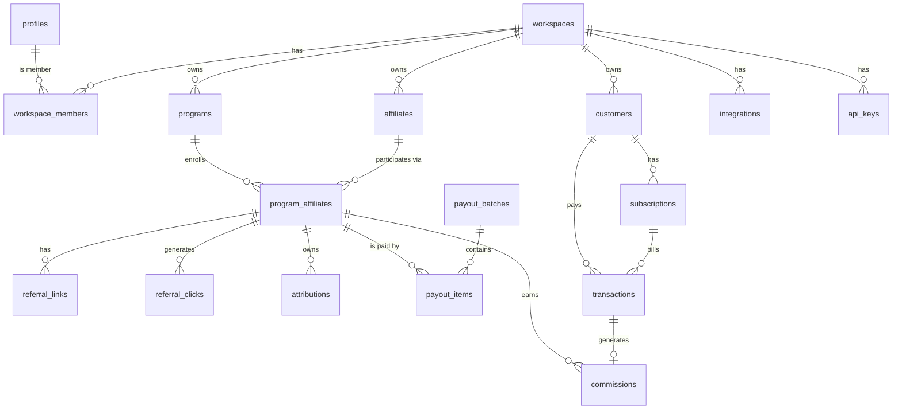

# DATABASE.md

**Read this before altering the schema, an index, or an RLS policy.**

Postgres (Supabase). Drizzle ORM. Migrations are versioned SQL in
`src/server/db/migrations/` and applied with `pnpm db:migrate`.

---

## 1. Conventions

- Primary keys are `uuid` with `gen_random_uuid()`.
- `created_at` / `updated_at` are `timestamptz` defaulting to `now()`.
  `updated_at` is maintained by the `set_updated_at()` trigger.
- **Money is never a float.** Integer minor units (`*_amount_minor`) plus an
  explicit `currency char(3)`. `$14.70 → 1470`.
- **Percentages are basis points.** `commission_value = 3000` means 30.00%.
  The same column holds minor units when `commission_type = 'fixed'`.
- Enumerations are native Postgres enums, so an invalid state cannot be written.
- Deletes cascade only along true ownership edges. Financial rows use
  `ON DELETE RESTRICT` — the ledger must not vanish when something upstream does.

---

## 2. Entity map



---

## 3. Tables

### Identity & tenancy

| Table | Purpose | Key constraints |
| --- | --- | --- |
| `profiles` | app-level user data; `id` references `auth.users(id)` | PK = auth user id |
| `workspaces` | the tenant | `slug` UNIQUE |
| `workspace_members` | membership + role (`owner`/`admin`/`member`) | UNIQUE `(workspace_id, user_id)` |
| `workspace_invites` | pending team invitations, claimed by e-mail at sign-up or, for existing accounts, at sign-in (migration 0008) | UNIQUE `(workspace_id, lower(email))` where unaccepted (migration 0002) |

### Program configuration

`programs` — `workspace_id`, `name`, `slug`, `description`, `website_url`, `status`
(`draft`/`active`/`paused`/`archived`), `commission_type`
(`percentage`/`fixed`), `commission_value` (bps **or** minor units),
`commission_duration_months` (`NULL` = lifetime, `1` = first payment only),
`attribution_model` (`first_click`/`last_click`), `attribution_window_days`,
`commission_hold_days`, `currency`.
UNIQUE `(workspace_id, slug)`. `CHECK (commission_value > 0)`,
`CHECK (attribution_window_days BETWEEN 1 AND 365)`.

`website_url` (nullable `text`, migration 0005) is the product's own site —
where the founder installed the tracker. The affiliate's default referral link
is `website_url?ref=<code>`; while it is `NULL` the portal offers no default
link, because a link to any other host never reaches the tracker. Validated at
the form boundary as an http(s) URL of at most 2048 characters. It needs no
policy of its own: RLS is row-scoped, so founders write it under
`programs_admin_write` and enrolled affiliates read it through
`programs_affiliate_select`, exactly like the program's other columns.

The form never stores `commission_duration_months = 1` for "a number of
months": that value *is* "first payment only", so the months option starts at 2.

`attribution_window_days` and `commission_duration_months` are different clocks:
the window is the deadline for a click to become a paying customer, the duration
is how long that customer's renewals keep earning. See ARCHITECTURE.md §5.

`affiliates` — `workspace_id`, nullable `user_id` (an affiliate may exist before
they ever sign in; the row is claimed on first login by matching e-mail),
`email`, `name`, `company_name`, `country`, `status`
(`invited`/`active`/`suspended`). UNIQUE `(workspace_id, lower(email))`.

`program_affiliates` — the join that actually matters. `code` is the public
referral identifier (`?ref=wendel`), `status`
(`pending`/`approved`/`rejected`/`suspended`), optional
`custom_commission_type` + `custom_commission_value` (the VIP rate),
`approved_at`. UNIQUE `(program_id, code)` and UNIQUE `(program_id, affiliate_id)`.
`CHECK (code ~ '^[a-z0-9][a-z0-9_-]{1,48}$')`.

`referral_links` — named destinations under one participation.
UNIQUE `(program_affiliate_id, code)`. `click_count_cached` is a display
convenience and **never** a source of truth; `referral_clicks` is.

### Event & attribution

`referral_clicks` is the highest-volume table. It stores `visitor_id`,
`landing_url`, `referrer_url`, the five UTM fields, a coarse `country` and
`device_type`, and `ip_hash` — a salted SHA-256, never a raw IP — for abuse
detection under a short retention window. No user agent string, no PII.

Indexes:
```
(program_id, occurred_at DESC)
(program_affiliate_id, occurred_at DESC)
(visitor_id, occurred_at DESC)
(referral_link_id) WHERE referral_link_id IS NOT NULL
```

`attributions` is the critical entity. UNIQUE `(program_id, visitor_id)` — one
live attribution per visitor per program, updated in place according to the
program's model. It holds `first_click_id`, `last_click_id`, the model that was
applied, `attributed_at` and `expires_at`, plus the binding fields
`customer_external_id` and `provider_customer_id` written by `/api/identify`.
Partial indexes on those two columns make webhook resolution a single lookup.

### Billing facts

`customers` — the SaaS client's customers, not ours. `external_id` is the
client's own id; `provider_customer_id` is Stripe's. Only `email_hash` is
stored, never the address. UNIQUE `(workspace_id, provider, provider_customer_id)`
and UNIQUE `(workspace_id, external_id)`.

`subscriptions` — mirror of the provider's subscription: `status`, `currency`,
`amount_minor`, `interval`, period bounds. UNIQUE `(provider, provider_subscription_id)`.

`transactions` — the money that actually moved: `type`
(`payment`/`refund`/`chargeback`/`adjustment`), `gross_amount_minor`, `status`,
`occurred_at`. **UNIQUE `(workspace_id, provider, provider_transaction_id)`** —
this is the second idempotency barrier behind `webhook_events`. A refund or
dispute row is stored under the refund/dispute id (`re_…`, `dp_…`) with
`provider_parent_transaction_id` = the payment it undoes.

`transaction_references` — every provider id of one payment (`in_…`, `pi_…`,
`ch_…`) → the `provider_transaction_id` it was recorded under. UNIQUE
`(workspace_id, provider, reference_id)`. Keyed by provider id, not by
`transactions.id`, because Stripe's `invoice_payment.paid` (the invoice ↔
PaymentIntent link) may arrive before the invoice payment. Refunds and disputes,
which carry only the PaymentIntent and charge, find their payment through it.
Written only by the webhook ingest path; no API role can read it.

`customers.email_hash` doubles as the payment → customer fallback: when no
customer has a payment's provider customer id, exactly one identified customer
with the same hash (and no, or the same, provider id) is matched, and its empty
`provider_customer_id` — never a different one — is back-filled.

### Ledger

`commissions` — one row per commission event.

```
base_amount_minor        what the commission was computed from
commission_rate          basis points, NULL for fixed rules
commission_amount_minor  signed: negative on a reversal
status                   pending → available → approved → paid
                                 ↘ reversed / rejected
eligible_at              created_at + program.commission_hold_days
reversal_of_commission_id  set on reversal rows
```

Rules:

- A commission is **never deleted and never edited downward**. A refund or
  dispute inserts a *reversal* row with a negative amount, proportional and
  cumulative: `round_half_up(commission × refunded so far / base)` minus earlier
  reversals, so partial refunds never drift and the full refund reverses exactly
  the commission.
- The original flips to `reversed` only when refunds cover the whole payment
  (and then its earlier, unbatched partial rows settle to `reversed` too). A
  partial reversal row takes a payable status instead — `pending` with the
  original's `eligible_at`, or `available` — so a payout batch nets it against
  the original. No new status exists for this.
- A `paid` commission is never rewritten. Its reversal row is recorded as
  `reversed` and nothing is clawed back — an open gap.
- `UNIQUE (transaction_id, program_affiliate_id)` where
  `reversal_of_commission_id IS NULL` — one commission per transaction per
  affiliate, whatever the webhook does.
- `pending → available` is a pure function of `eligible_at <= now()`. It can be
  promoted lazily on read or by an optional idempotent job; no worker is required.

### Payouts

`payout_batches` (`draft`/`approved`/`paid`/`cancelled`) and `payout_items`.
A payout records that *the founder says they paid*. The platform moves no money.
`payout_items` snapshots `amount_minor` at batch time so later ledger activity
cannot retroactively change a historical payout.

### Platform plumbing

| Table | Purpose |
| --- | --- |
| `integrations` | one connected billing account per workspace+provider. UNIQUE `(workspace_id, provider)`. `encrypted_credentials` is AES-256-GCM; plaintext secrets are never stored. |
| `api_keys` | `pk_`/`sk_` credentials. Stores `key_prefix` for display and `key_hash` (sha256) for verification. UNIQUE on `key_hash`. The secret is shown once. |
| `webhook_events` | **UNIQUE `(provider, provider_event_id)`**. The idempotency gate. Holds `payload_hash`, `status`, `error_message`. Index `(workspace_id, received_at DESC)` for the latest event per workspace. |
| `audit_logs` | `entity_type`, `entity_id`, `action`, `metadata jsonb`, `actor_user_id`. Append-only. |

---

## 4. Money & rounding

All arithmetic is integer. Percentage commission:

```
commission_minor = round_half_up(base_minor * rate_bps / 10_000)
```

`4900 * 3000 / 10000 = 1470` → `$14.70`. Rounding is half-up on the minor unit
and is unit-tested. Mixed currencies are never summed: every aggregate groups by
`currency`, and a payout batch is single-currency by construction.

---

## 5. Indexing strategy

Beyond the primary and unique keys:

```sql
workspace_members  (user_id)
programs           (workspace_id, status)
affiliates         (workspace_id, status), (user_id) WHERE user_id IS NOT NULL
program_affiliates (affiliate_id), (program_id, status)
attributions       (program_id, visitor_id) UNIQUE
                   (provider_customer_id) WHERE NOT NULL
                   (customer_external_id)  WHERE NOT NULL
transactions       (workspace_id, occurred_at DESC), (subscription_id)
commissions        (workspace_id, status, eligible_at)
                   (program_affiliate_id, status)
                   (transaction_id)
payout_items       (payout_batch_id), (program_affiliate_id)
webhook_events     (status, received_at DESC), (workspace_id, received_at DESC)
transaction_references (workspace_id, provider, reference_id) UNIQUE
audit_logs         (workspace_id, created_at DESC)
```

`referral_clicks` is expected to dominate row count. It is append-only, has no
foreign key from anything hot, and is a natural candidate for monthly range
partitioning once volume justifies it — not before.

---

## 6. Row Level Security

RLS is `ENABLE`d **and** `FORCE`d on every tenant table. Three
`SECURITY DEFINER` helpers keep policies short and index-friendly:

```sql
public.is_workspace_member(ws uuid) returns boolean
public.has_workspace_role(ws uuid, roles text[]) returns boolean
public.current_affiliate_ids() returns setof uuid
```

Policy shapes:

| Table group | Founder policy | Affiliate policy |
| --- | --- | --- |
| `workspaces`, `programs`, `affiliates`, `customers`, `subscriptions`, `transactions`, `integrations`, `api_keys`, `payout_batches`, `audit_logs` | `is_workspace_member(workspace_id)` | none (no direct read) |
| `program_affiliates`, `referral_links`, `referral_clicks`, `attributions` | member of the owning program's workspace | row belongs to `current_affiliate_ids()` |
| `commissions`, `payout_items` | `is_workspace_member(workspace_id)` | own `program_affiliate_id` only, `SELECT` only |
| `webhook_events`, `transaction_references` | no policy, no grant — reachable only by the Drizzle service connection | none |

Members still need to know whether Stripe events arrive. Rather than opening
`webhook_events` (payload hashes, raw error text, events with no workspace yet),
migration `0007` adds one narrow function:

```sql
public.latest_webhook_event(p_workspace_id uuid)
  returns table (received_at timestamptz, event_type text, status webhook_status)
  -- SECURITY DEFINER, STABLE, SET search_path = ''
  -- WHERE workspace_id = p_workspace_id AND public.is_workspace_member(p_workspace_id)
  -- ORDER BY received_at DESC LIMIT 1
  -- EXECUTE revoked from public and anon, granted to authenticated
```

A non-member gets zero rows; `anon` cannot execute it; direct `SELECT` on the
table stays `permission denied`. `server/services/integration-health.ts` calls it
under `withUser()`. Verified against the dev database with `request.jwt.claims`
set as a member (1 row), as a non-member (0 rows) and as `anon` (denied).

Writes are additionally narrowed: only `owner`/`admin` may mutate programs,
integrations, API keys and payouts. Affiliates have **no** `INSERT`, `UPDATE` or
`DELETE` on any financial table — an affiliate cannot approve their own
commission, by construction rather than by convention.

Migration `0002` tightened two things the original policy set left open:

- `affiliates_self_update` was **dropped**. It was `FOR UPDATE USING (user_id =
  auth.uid())`, and RLS has no column scope, so an affiliate could rewrite their
  own `status` or `workspace_id` — the single column tenant isolation rests on.
  Affiliates now have no write on `affiliates` at all. Re-introducing
  self-service profile editing needs a `BEFORE UPDATE` trigger that restores the
  protected columns, because `WITH CHECK` cannot compare `OLD` to `NEW`.
- `DELETE` was **revoked** on `commissions` and `transactions` for
  `authenticated`. The `<t>_admin_write` policies are `FOR ALL`, so an
  owner/admin could previously delete a ledger row, contradicting the
  append-mostly rule above. `UPDATE` remains — `createPayoutBatch()` needs it.

`ENABLE ROW LEVEL SECURITY` plus `FORCE` means even the table owner is subject to
policy. The only bypass used by application code is the Drizzle service
connection (`DATABASE_URL`), confined to the three call sites listed in
`ARCHITECTURE.md` §2; everything else runs through `withUser()` / `withAnon()`.
The Supabase secret key (`SUPABASE_SECRET_KEY`, `lib/supabase/admin.ts`) is a
separate mechanism with two call sites — `server/db/seed/auth.ts`, which
provisions demo logins, and `server/services/invite-mail.ts`, which sends Auth
invitation e-mails. It is never a substitute for writing a policy.

**Claiming invitations for existing accounts (migration 0008).**
`handle_new_user()` claims pending affiliate rows and workspace invites only
when an auth user is created. `public.claim_pending_invites()` does the same
three writes for an account that already existed: `SECURITY DEFINER`, empty
`search_path`, `EXECUTE` for `authenticated` only. It takes no argument — the
address is read from `auth.users` for `auth.uid()`, and only when
`email_confirmed_at` is set — so a caller can never claim an invitation for an
e-mail they don't control. The app calls it after password sign-in, after the
auth callback and on `/app` (`claimPendingInvites` in
`server/services/workspaces.ts`).

Isolation is **not** regression-tested yet. `src/server/db/__tests__/rls.test.ts`
— tenant A cannot read tenant B, affiliate A cannot read affiliate B — is
required work, blocked on a reachable database. Until it exists, treat the
policy matrix above as reviewed but unverified: AUDIT_REPORT.md P0-1 is exactly
the class of defect that test would have caught.

---

## 7. Data protection (LGPD / GDPR)

- No raw IP addresses. `ip_hash = sha256(ip + HASH_PEPPER)` (`lib/crypto/hash.ts`),
  retained 90 days.
- No customer e-mail addresses. `email_hash = sha256(lower(trim(email)) + pepper)`,
  which still supports the identify/matching flow without holding the data.
- No user agent strings — only a coarse `device_type`.
- Affiliate PII (`name`, `email`, `country`) is minimal, purpose-bound and
  deletable: removing an affiliate anonymises the row and preserves the ledger,
  which is a legitimate-interest financial record.
- `audit_logs.metadata` must never contain secrets, tokens or full payloads.

---

## 8. Plans

Migration `0006` makes the plans on the pricing page real. There is **no
checkout and no automatic billing**: a workspace starts on Starter, an owner or
admin requests Growth from Settings → Plan, the team arranges payment, and the
operator switches the plan with the service connection (README, "Mudar o plano
de um workspace").

| Object | Shape |
| --- | --- |
| `workspace_plan` enum | `starter`, `growth` |
| `workspaces.plan` | `workspace_plan NOT NULL DEFAULT 'starter'` |
| `plan_upgrade_requests` | `workspace_id` (FK, cascade), `requested_plan`, `requested_by` (auth user id), `handled_at` (null while open), `created_at`. Index `(workspace_id, created_at DESC)`; **partial UNIQUE `(workspace_id, requested_plan) WHERE handled_at IS NULL`** — one open request per plan, so a double click cannot file two |

What each plan includes is not in the database. `src/lib/plans.ts` is the one
table — limits (Starter: 1 program, 10 affiliates, 1 member; Growth: unlimited
programs and affiliates, 10 members) and gated features (custom rates, team
invites, audit log). Services enforce it with `assertWithinPlan()` /
`assertPlanFeature()` from `server/services/plans.ts` inside their own
transaction, right before the write; the pricing page and the Settings panel
render the same table. "Members" counts `workspace_members` plus unaccepted
`workspace_invites`.

### Grants and RLS

- **Column grant on `workspaces`.** `0001` granted table-wide `UPDATE` to
  `authenticated`, and RLS has no column scope, so an owner/admin could have set
  `plan = 'growth'` through the Supabase API. `0006` revokes `UPDATE` and grants
  it back only on `(name, slug, logo_url, default_currency, timezone,
  updated_at)`. `plan` is writable by the service connection alone. A new
  user-editable column on `workspaces` must be added to that grant.
- **`plan_upgrade_requests`** is `ENABLE`d and `FORCE`d. `authenticated` has
  `SELECT, INSERT` only:
  - `plan_upgrade_requests_member_select` — `is_workspace_member(workspace_id)`.
  - `plan_upgrade_requests_admin_insert` — `requested_by = auth.uid()`,
    `handled_at IS NULL`, and `has_workspace_role(workspace_id, owner|admin)`.
  - No `UPDATE`/`DELETE`: marking a request handled is an operator action.
- `audit_logs` needs nothing new: its `member_select` policy (`0001`) already
  lets members read, and `listAuditLog()` narrows the Settings view to
  owners/admins on a plan with `auditLog`. Filing a request writes a
  `plan.upgrade_requested` audit row.
